# Implementing ML Algorithms from Scratch

This repo contains the implementation for a few basic ML algorithms from scratch in python

### 1. K-Nearest-Neighbours (KNN)

Given a data point

- Calculate its distance from all other data points (slow)
- Get the closest K points (hyperparameter, user-determined)
- _Regression_: Get the average of their values
- _Classification_: Get the label with majority vvote

Find the implementation in the file `knn.py`

### 2. Linear Regression

Understand the pattern/slope of the given dataset
Need to find a linear line (pun intended) that fits the data as closely as possible

$$ \hat{y} = wx + b $$

We also find the mean square error (MSE) for our regression.

$$ MSE = J(w, b) = \frac{1}{N} \sum_{i=1}^{n}{(y_i - (wx_i + b)^2)} $$

To find the best fitting line, we find the values for $w$ and $b$ that would give us the minimum MSE.

And to minimze something, we calculate the derivative, or the so called gradient of the MSE

$$ J'(m, b) = \begin{bmatrix} \frac{df}{dw} \\ \frac{df}{db} \end{bmatrix} = \begin{bmatrix} \frac{1}{N} \sum_{i=1}^{n}{(-2x_i(y_i - (wx_i + b))} \\ \frac{1}{N} \sum_{i=1}^{n}{-2(y_i - (wx_i + b))} \end{bmatrix} $$

And to do this optimization we use the technique called Gradient Descent. We keep altering the weight in the said direction until the MSE approaches Glocal Cost minimum $$ J_{min}(w) $$

Once we have it, we multiply it with the learning rate and subtract it from the (weight, bais) or the parameterst

$$ w = w - \alpha \cdot dw $$
$$ b = b - \alpha \cdot db $$

Learning rate is the deciding factor for how fast or slow to go in the Minimum MSE direction.
A good learning rate will reach the minimum MSE nicely.
A Too low rate will never reach the min MSE, while a too high rate will just keep bouncing off the graph overshooting and creating complete chaos.

#### **Steps**:

- **Training**:
  - Initialize weights as zeros (or prefer random values)
  - Initialize biases as zeros (or prefer random values)
- **Given a data point**:
  - Predict result by using $\hat{y} = wx + b$
  - Calculate error
  - Use gradient descent to figure out new weight and bias
  - Repeat n times

Find the implementation in the file `linear_regression.py`

### 3. Logistic Regression

Unline linear regression, we find a probability dstribution map, using the logistic function, generally the sigmoid function

$$ s(x) = \frac{1}{1 + e^{-x}} $$

So the regression equation becomes

$$ \hat{y} = h_{\theta}(x) = \frac{1}{1 + e^{-(wx+b)}} $$

We calculate the error not using MSE, but the Cross Entropy. It is still the derivative of the regression equation.
Gradient Descent is used for adjustments, which calculates the derivates wrt weight and bias. Same equations!

#### **Steps**:

- **Training**:
  - Initialize weights as zeros (or prefer random values)
  - Initialize biases as zeros (or prefer random values)
- **Given a data point**:
  - Predict result by using $\hat{y} = \frac{1}{1 + e^{-(wx + b)}}$
  - Calculate error
  - Use gradient descent to figure out new weight and bias values
  - Repeat n times
- **Testing**
  - Given a data point:
    - Put the values from the data point into the equation $\hat{y} = \frac{1}{1 + e^{-(wx + b)}}$
    - Choose label based on probability

Find the implementation in the file `logistic_regression.py`

### 4. Decision Trees

Decision trees are hierarchical structures that split the data into subsets based on feature values.
Starting from a root node containing all data, the algorithm recursively partitions the data by choosing optimal splitting criteria at each node.
The goal is to create homogeneous groups in the leaf nodes.
This makes the prediction data to trickle down the tree answer each splitting question, into it's catergory/classification

We need to decide on the
1. Split feature
2. Split point
3. When to stop splitting

#### **Steps**:

- **Training**:
  Given the whole dataset:
    - Calculate _information gain_ with each possible split
    - Divide set with that feature and value that gives the most IG
    - Divide tree and do the same for all created branches...
    - ...until a _stopping criteria_ is reached

- **Testing**:
  Given a data point:
    - Follow the tree until you reach a leaf node
    - Return the most common class label

**Information Gain**: $IG = E(parent) - [weighted\  average] \cdot E(children)$

where E(x) is entropy, lack of order.
Entropy of a node is zero is there is only one class in it.
Entropy is 1 if classes are evenly spread in a node

**Entropy**: $E = - \sum{p(X) \cdot log_2(p(X))}$

Where, $p(X) = \frac{x}{n}$, i.e. the number of times class in node / number of total nodes

**Stopping Criteria**: Maximum depth, minimum number of samples, min impurity decrease.

Find the implementation in the file `decision_tree.py`

### 5. Random Forest

Random Forest creates a specified number of trees (naturally)! on a random subset of samples, and predicts based on the majority vote of all trees.

#### **Steps**:

- **Training**:
  Given the whole dataset:
    - Get a subset of the dataset randomly
    - Create a decision tree
    - Repeat for as many times as the number of trees

- **Testing**:
  Given a data point:
    - Get the predictions from each tree
    - _Classificiation_: hold a majority vote
    - _Regression_: get the mean of the precitions

Find the implementation in the file `random_forest.py`

### 6. Naive Bayes

The Naive Bayes classifier is a "probabilistic classifier" based on applying Bayes' theorem with strong (naive) independence assumptions between the features.

Bayes' Theorem states
$$ P(A|B) = \frac{P(B|A) \cdot P(A)}{P(B)} $$

Translating to our case, we have

$$ P(y|X) = \frac{P(X|y) \cdot P(y)}{P(X)} $$
Where, y are the class labels while X is the feature vector.

Now for this, the features must be mutually independent.
$$ P(y|X) = \frac{P(X|y) \cdot P(y)}{P(X)} $$
$$ \downarrow $$
$$ P(y|X) = \frac{P(x_1|y) \cdot P(x_2|y) \cdot P(x_3|y) \cdot \dots \cdot P(y)}{P(X)} $$

Select class with highest posterior porbability (that $P(y|X)$ )

$$ y = argmax_y P(y|X) $$
since it contains product terms, and each probability is between 0 and 1, multiplication can result in exteml
$$ y = argmax_y log(P(x_1|y)) + log(P(x_2|y) + ... + log(P(x_n|y)) + log(P(y)) $$

#### Prior and Class Conditional

$P(y)$ - Prior probability --> Frequency of each class
$P(x_i|y)$ - Class conditional probability --> Model with Gaussian

Gaussian Formula
$$ P(x_i|y) = \frac{1}{\sqrt{2 \pi \sigma_y^2}} \cdot exp(-\frac{(x_i - \mu_y)^2}{2\sigma_y^2}) $$

#### **Steps**:

- **Training:**
  - Calculate mean, var, and prior (frequency) for each class

- **Predictions:**
  - Calculate posterior for each class with $y = argmax_y log(P(x_1|y)) + log(P(x_2|y) + ... + log(P(x_n|y)) + log(P(y))$ and the Gaussian formula
  - Choose class with highest posterior probability

Find the implementation in the file `naive_bayes.py`

### 7. Principal Component Analysis (PCA)

Principal Component Analysis, or PCA, is an **unsupervised learning method** that is often used to reduce the dimensionality of the dataset
by transforming a large set into a lower dimensional set that still retains most of the information. Therefore, we do not need to know the class labels!

PCA find a new set of dimensions such that all the dimensions are orthogonal (and hence linearly independent)
and ranked according to the variance of data along them.

Find a transformation such that
- The transformed features are **linearly independent**
- **Dimensionality can be reduced** by taking only the dimensions with the highest importance
- Those newly found dimensions should **minimize the projection error**
- The projected points should have maximum spread, i.e. **maximum variance**

#### **Variance**
How much variation or spread the data has
$$ Var(X) = \frac{1}{n}\sum(X_i - \bar{x})^2 $$

#### **Covariance Matrix**
Indicates the level to which two variables vary together
$$ Cov(X, Y) = \frac{1}{n}\sum(X_i - \bar{x})(Y_i - \bar{Y})^T $$
$$ Cov(X, X) = \frac{1}{n}\sum(X_i - \bar{x})(X_i - \bar{X})^T $$

#### **Eigenvector, Eigenvalues**

Calculate eigenvectors of $Cov(X, X)$

The eigenvectors point in the direc=ction of the maximum variance, and the corresponding eigenvalues indiate the importance of its corresponding eigenvector.

$$ A\tilde{v} = \lambda\tilde{v} $$

#### **Steps**:
- Subtract mean from X
- Calculate Cov(X, X)
- Calculate eigenvectors and eigenvalues of the covariance matrix
- Sort the eigenvectors according to thier eigenvalues in decreasing order
- Choose first k eigenvectors and that will be the new k dimensions
- Transform the original n-dimensional data point into k dimensions ( = Projections with dot product)

Find the implementation in the file `pca.py`

### 8. Perceptron

The perceptron is an algorithm for supervised learning of binary classifiers.
It can be seen as a single unit of an artificial neural network and is also known as the prototype for Neural Nets.

**Single Layer Perceptron: Can only learn linearly separable patterns**
Multi Layer Perceptron: Can learn more complex patterns

#### Inspired by Neuron
It's a simplified model of a biological neuron and simulates the behaviour of one cell.
For us, it is a single-layer neural network with the unit step function as an activation function.

```mermaid
graph LR
  1((1)) --> |w0| s{Σ}
  x1((x1)) --> |w1| s
  x2((x2)) --> |w2| s
  xn((xn)) --> |wn| s
  s --> step[Activation Function or Step Function] --> out(Output)
```

#### **Linear Model**
$$ f(x) = w^T x + b $$

#### **Activation Function**
Unit step function
$$ g(x) = \begin{cases}
1 & \text{if } z \ge \theta \\
0 & \text{otherwise}
\end{cases} $$

#### **Approximation**
$$ \hat{y} = g(f(x)) = g(w^T x + b) $$

#### **Perceptron Update Rule**
Super intiutive and amazing, gradient descent

$w = w + \delta w$

$b = b + \delta b$

$\delta w = \alpha \cdot (y_i - \hat{y_i}) \cdot x_i$

$\delta b = \alpha \cdot (y_i - \hat{y_i}) \cdot x_i$

Learning rate $\alpha$ is in [0, 1], generally small, defines how fast to descent on the gradient

| $y$ | $\hat{y} | $y - \hat{y}$ |
| --- | -------- | ------------- |
| 1   | 1        | 0             |
| 1   | 0        | 1             |
| 0   | 0        | 1             |
| 0   | 1        | -1            |

--> Weights are automatically pushed towards positive or negative target class in case of missclassification!

This is a very intiutive model!

#### **Steps**:
- **Training (Learn Weights)**:
  - Intialize weights
  - For each sample:
    - Calculate $\hat{y} = g(f(x)) = g(w^T x + b)$
    - Apply update rule: $\delta w = \alpha \cdot (y_i - \hat{y_i}) \cdot x_i,\ \delta b = \alpha \cdot (y_i - \hat{y_i})$

- **Prediction**:
  - Calculate $\hat{y} = g(f(x)) = g(w^T x + b)$

Find the implementation in the file `perceptron.py`

### 9. Support Vector Machine (SVM)

Idea: Use a linear model and try to find a linear decision boundary (also called a hyperplane) that best spearates the data.
The best hyperplane is the one that yields the largest separation/margin between both classes.
So we choose the hyperplane so that the distance from it to the nearest data point on each side is maximized.

$$ w \cdot x_i - b \ge 1\ if\ y_i = 1 $$
$$ w \cdot x_i - b \le -1\ if\ y_i = -1 $$
$$ y_i (w \cdot x_i - b) \ge 1, with\ y \in {-1, 1} $$

#### **Loss Function: Hinge Loss**

$$ l = max(0, 1 - y_i (w \cdot x_i - b)) $$

$$ l = \begin{cases}
0 & \text{if } y \cdot f(x) \ge 1 \\
1 - y \cdot f(x) & \text{otherwise}
\end{cases} $$

Rest is still too complex for me to understand right now. I will take a look at them later

#### **Steps**:
- **Training**:
  - Initialize weights
  - Make sure $y \in {-1, 1}$
  - Apply update rules for _n_iters_

- **Prediction**
  - Calculate $y = sign(w \cdot x - b)$

Find the implementation in the file `svm.py`

### 10. KMeans

KMeans is an **unsupervised learning** method (unlabeled data) that clusters data set into k different clusters.
Each sample is assigned to the cluster with the nearest means, and then the mean (centroids) and cluster are updated during an interative optimization process.

#### Interative Optimization Process

1. Initialize cluster centers (e.g. randomly)
2. Repear until converged:
  - Update cluster labels: Assign points to the nearest cluster center (centroid)
  - Update cluster centers (centroid): Set center to the mean of each cluster

#### Educlidean Distance

Get the distance between two feature vectors
$$ d(p, q) = \sqrt{\sum (p_i - q_i)^2} $$
